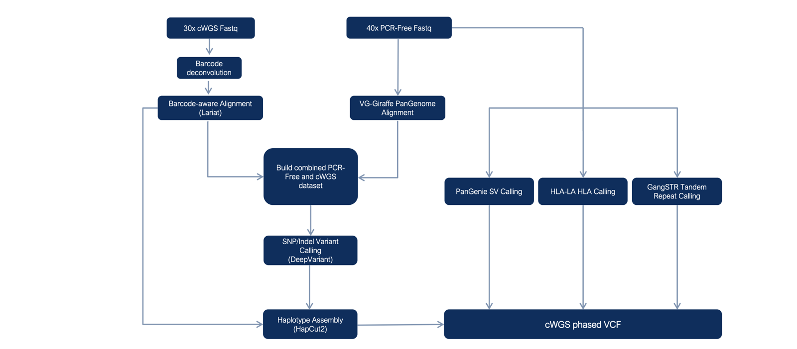

# Complete WGS (cWGS)  
This is a pipline the enables the mapping, variant calling, and phasing of input fastq files from a PCR free (PF) and a Complete Genomics' DNBSEQ Complete WGS (cWGS) (a DNA cobarcoding technology, previous name stLFR) library of the same sample. Running this pipeline results in a highly accurate and complete phased vcf. We recommend at least 40X depth for the PCR free library and 30X depth for the cWGS library. Below is a flow chart which summarizes the pipeline processes. *Note, SV detection with Pangenie is a beta version of the pipeline.



A more detailed flow chart.  

```mermaid
flowchart TD

    subgraph INPUT["Input"]
        samplesheet([samplesheet]) --> toCsv[toCsv]
        toCsv --> parse_sample[parse_sample]
        parse_sample --> fq[(fq)]
    end

    subgraph QC_PF["QC — PF Reads"]
        qc_pf[qc_pf] --> readLenPf[readLenPf]
        qc_pf --> fqcheckPf[fqcheckPf]
        fqcheckPf --> fqdistPf[fqdistPf]
        qc_pf --> fqstats_pf[fqstats_pf]
    end

    subgraph QC_STLFR["QC — stLFR Reads"]
        qc_stlfr_stats[qc_stlfr_stats] --> readLen[readLen]
        qc_stlfr_stats --> basecount[basecount]
        qc_stlfr_stats --> fqstats_stlfr[fqstats_stlfr]
    end

    subgraph ALIGN_PF["Alignment — PF"]
        bwaPf[bwaPf] --> markdupPf[markdupPf]
        markdupPf --> sampleBamPf[sampleBamPf]
    end

    subgraph STATS_PF["Stats — PF BAM"]
        sampleBamPf_s[sampleBamPf] --> coveragePf[coveragePf]
        sampleBamPf_s --> coverageMeanPf[coverageMeanPf]
        sampleBamPf_s --> samtoolsFlagstatPf[samtoolsFlagstatPf]
        sampleBamPf_s --> samtoolsStatsPf[samtoolsStatsPf]
        sampleBamPf_s --> samtoolsDepthPf[samtoolsDepthPf]
        sampleBamPf_s --> insertsizePf[insertsizePf]
        samtoolsFlagstatPf --> alignCatPf[alignCatPf]
        samtoolsStatsPf --> alignCatPf
        samtoolsDepthPf --> alignCatPf
        insertsizePf --> alignCatPf
    end

    subgraph VC_PF["Variant Calling — PF"]
        sampleBamPf_v[sampleBamPf] --> deepvariantv16BwaPf[deepvariantv16]
        deepvariantv16BwaPf --> vcfevalPf[vcfevalPf]
    end

    subgraph ALIGN_STLFR["Alignment — stLFR / Lariat"]
        barcode_split[barcode_split] --> splitfq[splitfq]
        splitfq --> lariatBC[lariatBC]
        lariatBC --> mergeFq[mergeFq]
        mergeFq --> lariat[lariat]
        lariat --> sortbam[sortbam]
        sortbam --> markdupStlfrLariat[markdupStlfrLariat]
        markdupStlfrLariat --> sampleBamStlfrLariat[sampleBamStlfrLariat]
    end

    subgraph STATS_STLFR["Stats — stLFR BAM"]
        sampleBamStlfrLariat_s[sampleBamStlfrLariat] --> samtools_flagstat[samtools_flagstat]
        sampleBamStlfrLariat_s --> samtools_stats[samtools_stats]
        sampleBamStlfrLariat_s --> insertsize[insertsize]
        sampleBamStlfrLariat_s --> samtools_depth[samtools_depth]
        sampleBamStlfrLariat_s --> stLFRQC[stLFRQC]
        samtools_flagstat --> align_cat[align_cat]
        samtools_stats --> align_cat
        samtools_depth --> align_cat
        insertsize --> align_cat
    end

    subgraph PHASE["Phasing"]
        intersectLariat[intersectLariat] --> mergeBamLariat[mergeBamLariat]
        mergeBamLariat --> deepvariantv16[deepvariantv16]
        mergeBamLariat --> coverage[coverage]
        mergeBamLariat --> coverageMean[coverageMean]
        coverage --> coverageAvg[coverageAvg]
        coverageMean --> coverageAvg
        deepvariantv16 --> vcfevalLariatDv[vcfevalLariatDv]
        deepvariantv16 --> varStatsLariatDv[varStatsLariatDv]
        deepvariantv16 --> splitVcfLariatDv[splitVcfLariatDv]
        sampleBamStlfrLariat_p[sampleBamStlfrLariat] --> splitBam4phasing[splitBam4phasing]
        splitBam4phasing --> phaseLariatDv[phaseLariatDv]
        splitVcfLariatDv --> phaseLariatDv
        phaseLariatDv --> phaseCatLariatDv[phaseCatLariatDv]
        phaseCatLariatDv --> hapKaryotype[hapKaryotype]
        phaseCatLariatDv --> hapcutstat[hapcutstat]
        phaseCatLariatDv --> phaseall[phaseall]
        phaseCatLariatDv --> ideogram[ideogram]
        phaseCatLariatDv --> cumuplot[cumuplot]
    end

    subgraph SV_STR_HLA["SV / STR / HLA — hg38/GRCh38 only"]
        pangenie[pangenie] --> pangenie_var_plot[pangenie_var_plot]
        pangenie --> pangenie_plot[pangenie_plot]
        gangstr[gangstr]
        hlala[hlala]
    end

    subgraph ANNOT["Annotation — hg38/GRCh38 only"]
        vep_frombam[vep_frombam] --> vep_data[vep_data]
    end

    subgraph REPORT["Report"]
        reportLariatDv[reportLariatDv] --> report([report])
        report --> html([html])
    end

    %% Cross-subgraph edges
    fq --> qc_pf
    fq --> qc_stlfr_stats
    fq --> barcode_split
    qc_pf --> bwaPf

    sampleBamPf --> sampleBamPf_s
    sampleBamPf --> sampleBamPf_v
    sampleBamPf --> intersectLariat
    sampleBamPf --> mergeBamLariat

    sampleBamStlfrLariat --> sampleBamStlfrLariat_s
    sampleBamStlfrLariat --> sampleBamStlfrLariat_p
    sampleBamStlfrLariat --> intersectLariat
    sampleBamStlfrLariat --> mergeBamLariat

    %% SV/STR/HLA inputs
    fq --> pangenie
    mergeBamLariat --> gangstr
    mergeBamLariat --> hlala
    phaseCatLariatDv --> pangenie_plot

    %% Annotation input
    phaseCatLariatDv --> vep_frombam

    alignCatPf --> reportLariatDv
    vcfevalPf --> reportLariatDv
    align_cat --> reportLariatDv
    vcfevalLariatDv --> reportLariatDv
    varStatsLariatDv --> reportLariatDv
    coverageAvg --> reportLariatDv
    phaseCatLariatDv --> reportLariatDv
    stLFRQC --> reportLariatDv

    vep_data --> html
    pangenie_var_plot --> html
    pangenie_plot --> html
    hlala --> html

    %% Styling
    classDef input    fill:#dae8fc,stroke:#6c8ebf
    classDef qc       fill:#d5e8d4,stroke:#82b366
    classDef align    fill:#fff2cc,stroke:#d6b656
    classDef vc       fill:#f8cecc,stroke:#b85450
    classDef phase    fill:#e1d5e7,stroke:#9673a6
    classDef stats    fill:#f0f0f0,stroke:#666666
    classDef report   fill:#ffe6cc,stroke:#d79b00
    classDef sv       fill:#fce4d6,stroke:#c0504d
    classDef annot    fill:#e2efda,stroke:#70ad47

    class samplesheet,fq,parse_sample,toCsv input
    class qc_pf,readLenPf,fqcheckPf,fqdistPf,fqstats_pf,qc_stlfr_stats,readLen,basecount,fqstats_stlfr qc
    class bwaPf,markdupPf,sampleBamPf,barcode_split,splitfq,lariatBC,mergeFq,lariat,sortbam,markdupStlfrLariat,sampleBamStlfrLariat align
    class deepvariantv16BwaPf,vcfevalPf,deepvariantv16,vcfevalLariatDv,varStatsLariatDv vc
    class splitVcfLariatDv,splitBam4phasing,phaseLariatDv,phaseCatLariatDv,hapKaryotype,hapcutstat,phaseall,intersectLariat,mergeBamLariat,ideogram,cumuplot phase
    class coveragePf,coverageMeanPf,samtoolsFlagstatPf,samtoolsStatsPf,samtoolsDepthPf,insertsizePf,alignCatPf,samtools_flagstat,samtools_stats,insertsize,samtools_depth,stLFRQC,align_cat,coverage,coverageMean,coverageAvg stats
    class reportLariatDv,report,html report
    class pangenie,pangenie_plot,pangenie_var_plot,gangstr,hlala sv
    class vep_frombam,vep_data annot

```


# Requirements  
**Hardware requirements**  
Multiple core computer (default >=48CPU)  
Minium 72GB RAM  
Exact storage may vary depending on sample count and coverage, expect 1TB per sample.  
**Software requirements**  
Linux CentOS >=7  
You may need root access to install Singularity (Singularity is a more secure container platform as it does not require root access on execution, while Docker does.)      

# Installation   
1. On a Linux server, install singularity >= 3.8.1 with root on every nodes.
   
2. Download the singularity images (internet connection required) by the following commands:
```
cat <<EOF > CWGS.def
Bootstrap: docker
From: stlfr/cwgs:1.0.6
%post
    cp /90-environment.sh /.singularity.d/env/
EOF

singularity build --fakeroot CWGS.sif CWGS.def
```
**The users without root permission may build the .sif file locally then upload to server.**  
If the singularity doesn't support --fakeroot, you need sudo permission to run this command:
sudo singularity build CWGS.sif CWGS.def
```
singularity exec -B`pwd -P` --pwd `pwd -P` CWGS.sif cp -rL /usr/local/bin/CWGS /usr/local/bin/runit /usr/local/app/CWGS/PARAMS.txt /usr/local/app/CWGS/demo .
```
3. Download the database (internet connection required) by this command:
```
./CWGS -createdb
```
Or for MegaBolt or ZBolt nodes (MGI's Bioinformatics analysis accelerator, including MegaBOLT/ZBOLT/ZBOLT Pro)  
```
./CWGS -createdb --megabolt
```
This command will download around 32G data from internet and build index locally, which will occupy another 30G storage. Use [db_tree.txt](docs/db_tree.txt) to validate the completion of database creation.      
4. Test demo data:

```
cat << EOF > samplelist.txt
sample  stlfr1                      stlfr2                      pcrfree1                 pcrfree2
demo    demo/stLFR_demo_1M_1.fq.gz  demo/stLFR_demo_1M_2.fq.gz  demo/PF_demo_1M_1.fq.gz demo/PF_demo_1M_2.fq.gz
EOF
 
./CWGS samplelist.txt -local
```
Test demo data on clusters by SGE (Sun Grid Engine):
```
./CWGS samplelist.txt --queue mgi.q --project none
```
Test demo data on clusters by SGE (Sun Grid Engine) with MegaBolt/ZBolt nodes:
```
./CWGS samplelist.txt -bolt --queue mgi.q --project none --boltq fpga.q
```
5. ***UPDATE***  
To use SV function and pipeline version>1.0.6:  
Get all 6 new .sif container from Dockerhub (https://hub.docker.com/repository/docker/stlfr/complete_wgs), for example:   
```
name=pangenie
apptainer pull oras://docker.io/stlfr/complete_wgs:${name}
```
remove 'complete_wgs_' from the .sif name and put them in a folder ${sif_dir}.  
Install Nextflow (with conda etc.) in your environment to excute the pipeline.  
```
CWGS=DNBSEQ_Complete_WGS/CWGS
modules=DNBSEQ_Complete_WGS/modules
scripts=DNBSEQ_Complete_WGS/scripts
$CWGS run sample.list -sifs ${sif_dir} -B <your_drive>:<your_drive> -db $db -exec local -module ${modules} -script ${scripts} -debug --use_megabolt false --skipBarcodeSplit false --pfmapq 3 --pfAligner vg --ref ${ref} --ref_len ${ref_len}
```

   
# Run the pipeline  
**Note that the order of parameters matters: single dash parameters (-opt) should be placed before all double dash parameters (--opt)**     
     
1. Generate sample.list.
   start from raw fastq (cWGS/stLFR PE100, R2 is 100+42bp barcode e.g.) files (default)
      E.g.
   ```
   cat << EOF > sample.list
   sample	stlfr1	stlfr2	pcrfree1	pcrfree2
   demo1	/path/to/cWGS_01_1.fq.gz	/path/to/cWGS_01_2.fq.gz	/path/to/PCRfree_01_1.fq.gz	/path/to/PCRfree_01_2.fq.gz
   demo2	/path/to/cWGS_02_1.fq.gz	/path/to/cWGS_02_2.fq.gz	/path/to/PCRfree_02_1.fq.gz	/path/to/PCRfree_02_2.fq.gz
   EOF
   ```
      *paths above can be both absolute and relative
   
    start from barcode (BC) split/deconvolution fastq files (cWGS/stLFR PE100, R2 is 100bp e.g.) **(set --skipBarcodeSplit true)**
      format same as above.
   
    start from PCR-free and cWGS bam files (set --frombam true)
      E.g.
   ```
   cat << EOF > sample.list
   sample	stlfrbam	pfbam
   demo1	/path/to/cWGS_01.bam	/path/to/PCRfree_01.bam
   demo2	/path/to/cWGS_02.bam	/path/to/PCRfree_02.bam
   EOF
   ```
   Updates are pushed to the github module and script folders, use the latest ones. Currently, it's recommended to remove PF reads of MAPQ<3 with the --pfmapq tag. Also, to customize and make the pipeline adapt to your needs, you may revise the scripts. An example run:  
   ```
   ./CWGS run sample.list -module <module_path> -script <script_path> -exec local -debug --use_megabolt false --pfmapq 3
   ```
   Run customized reference with --ref </absolute/path/to/ref/fasta>; prepare all indices etc. in the same directory before run. Using the GRCh38 reference from the database building is recommended, otherwise hlala/pangenie/gangstr modules may be skipped.  
   To create .nonN.region file for the customized reference, run:
   ```
   python scripts/cwgs_supp.py --module nonN --input_fasta /absolute/path/to/customized_ref/fasta
   ```
   The .nonN.region file will be created in the same directory as the input fasta file.
   When using pangenome alignment vg, reference GCA_000001405.15_GRCh38_no_alt_analysis_set_corrected.fasta is required.  
   ```
   python scripts/cwgs_supp.py --module correct_hg38_fasta --db_path /absolute/path/to/CGWS_db
   ```
   Where CGWS_db is the db from -createdb. Then go to {db_path}/hg38/panGenome/ and manually samtools/bwa index GCA_000001405.15_GRCh38_no_alt_analysis_set_corrected.fasta.    

3. Run settings
    Set CPU
    ```
    --cpu2 INT
      Specify cpu number for QC, markdup, bam downsample, merge bam, bam stats calculation. [24]

    --cpu3 INT
      Specify cpu number for alignment and short variants calling (including BQSR and VQSR, if specified). [48]
    ```
    Sample the input fastq files
    ```
    --sampleFq BOOL
      if you want to initially sample the fastq file, set it true. [false]
    the following settings are valid only sampleFq is true
    --stLFR_fq_cov INT [only valid when '--sampleFq true']
    sample cWGS (stLFR) reads to this coverage [40] 
    
    --PF_fq_cov INT [only valid when '--sampleFq true']
    sample PCR-free reads to this coverage [50] 
    ```
    Alignment (BWA or Lariat) and variant calling (GATK or Deepvariant (DV)) relevant settings   
    ```
    --align_tool STRING
      Specify the alignment tool for cWGS reads. [lariat]
      Supports:
        bwa
        lariat
        bwa,lariat (this will execute both)

    --var_tool STRING
      Specify the variant calling tools for merged bam file. [dv]
      Supports:
        gatk
        dv (DeepVariant)
        gatk,dv (this will execute both)
    ```
    *If two alignment tools ("lariat,bwa") and two variant calling programs ("gatk,dv") are specified, four result sets will be generated.
    ```
    --gatk_version STRING [only valid when '--var_tool' contains "gatk"]
      Specify the GATK version. [v4]
      Supports:
        v3
        v4

    --run_bqsr BOOL [only valid when '--var_tool' contains "gatk"]
      Run Base Quality Score Recalibration (BQSR) of GATK. [true]

    --run_vqsr BOOL [only valid when '--var_tool' contains "gatk"]
      Run Variant Quality Score Recalibration (VQSR) of GATK. [true]

    --split_by_intervals BOOL [only valid when '--var_tool' contains "gatk" and '--use_megabolt' is false]
      Utilizes -L option for GATK haplotypecaller; split by chromosome. [true]

    --dv_version STRING [only valid when '--var_tool' contains "dv"]
      Specify the DeepVariant version. [default: v1.6]
      Supports: 
        v1.6
        v0.7
      Current MegaBOLT DeepVariant version is v0.7; therefore, if you specify this option to "v1.6", MegaBOLT will not be used even if '--use_megabolt' is true.
      To use pangenome-aware version of deepvariant, get docker image:
      sudo docker pull google/deepvariant:pangenome_aware_deepvariant-head784362481
      Convert to a .sif container and put to the $sif_dir folder. Run with tags:    
      ./CWGS run sample.list \
          --dv_sif_image ${sif_dir}/deepvariant_pangenome_aware_deepvariant-head784362481.sif \
          --dv_binary_path run_pangenome_aware_deepvariant \
          --dv_pangenome ${db}/hg38/panGenome/hprc-v1.1-mc-grch38.gbz \
          --dv_make_examples_extra_args 'keep_supplementary_alignments=true,sort_by_haplotypes=true,keep_only_window_spanning_haplotypes=true,min_mapping_quality=0,keep_legacy_allele_counter_behavior=true,normalize_reads=true' \
          --dv_postprocess_variants_extra_args 'multiallelic_mode=product' \
  ...

    ```
    Markdup
    ```
    --markdup STRING
    Specify the mark duplicates tool. [biobambam2]
    Supports: 
      biobambam2 (much faster than picard; recommended)
      picard
      gatk4 (MarkDuplicatesSpark)
      sambamba (not recommended)
    ```
    Downsample the bam file
    ```
    --sampleBam BOOL
      Whether downsample the cWGS bam and PCR-free bam. [true]

    --stLFR_sampling_cov INT [only valid when '--sampleBam true']
      Downsample cWGS (stLFR) bam to the specified coverage. [30]

    --PF_sampling_cov INT [only valid when '--sampleBam true']
      Downsample PCRFree bam to the specified coverage. [40]
    ```
    Merge the bam
    ```
    --PF_lt_stLFR_depth INT
      Extract the intersection regions from the sampled cWGS (stLFR) bam with depth greater than (>) this value and PCRFree bam with depth less equal than (<=) this value. [10]
    ```
   stLFR_only/ PF_only, runs using stLFR/PCR-free data alone, no merging   
   ```
   modules=$path_to_your_scirpts/DNBSEQ_Complete_WGS/modules
   scripts=$path_to_your_scirpts/DNBSEQ_Complete_WGS/scripts
   db=path to CWGS_db
   
   ./CWGS run sample.list -sif $sif -B $data_path:$data_path -module ${modules} -db $db -script ${scripts} -exec local -debug --use_megabolt false --stLFR_only true > run.log 2>&1
   ```
    Enable resuming the running
    ```
    --keepFiles BOOL
      By default, useless intermediate files will be deleted during the analysis to save storage. If you want to resume the run, set it true. [false]
    ```
    Debug mode (if you plan to rerun with different parameter setting to tune the results, use **-debug**)
    ```
    -debug
    By default, each process only keeps the output files. If you want to check the intermediate files within a process, use this flag.
    ```

4. Executor and MegaBOLT setting, four combinations:
    Make sure CWGS is in your PATH.
    1. on clusters by SGE (Sun Grid Engine) and no MegaBOLT (default)
        Confirm the working queue and project number, which can be specified using --queue, and --project for regular queue, and project id, respectively. Use "--project none" if the system doesn't support a project id.
        E.g.
        ```
        CWGS sample.list --queue all.q --project none > run.log 2>&1 &
        ```
    2. on clusters by SGE with MegaBOLT nodes.
        Ensure the clusters contain at least one MegaBOLT queue and have a queue for them, e.g. bolt.q.
        Confirm the working queue and project number, which can be specified using --queue, --boltq, and --project for regular queue, MegaBOLT queue, and project id, respectively. Use "--project none" if the system doesn't support a project id.
        E.g.
        ```
        CWGS sample.list -bolt --queue all.q --boltq bolt.q --project none > run.log 2>&1 &
        ```
    3. locally run, or slurm run
        Run with "-exec local" option.
        Run with "-exec slurm -partition ${partition} -nodelist ${nodelist} " option.
        E.g.
        ```
        CWGS sample.list -exce local > run.log 2>&1 &
        ```
    5. locally run on a MegaBOLT machine.
        Run with "-exce local" and "--use_megabolt true " option. 
        E.g.
        ```
        CWGS sample.list -exce local --use_megabolt true > run.log 2>&1 &
        ```
5. Parameters:  
   Set parameters with command line or with [nextflow.config](modules/nextflow.config). For example, MEM, CPU, deepvariant model dv_machine = "t7" or "g400".   
6. Tool versions:  
   To check tool versions  
   ```
   singularity exec $sif ${tool_name} —version
   ```

   

# Output of the demo example  
**Results**  
All output in the ./CWGS_run folder.   
1. The report.csv (in ./CWGS_run/out or ./result) is a summary report, with all intermediate metrics, results of mapping, variant calling, phasing etc.     
[report.csv](CWGS_run/out/report.csv)  
2. FQ, BAM, VCF output   
The FQs are in ./CWGS_run/out/<sample_name>/fq, QC by SOAPnuke.  
(demo_split_*.fq.gz are the FQ after barcode deconvolution)   
```
demo.pf.bssq
demo.pf.qc_1.fq.gz
demo.pf.qc_2.fq.gz
demo_split_1.fq.gz
demo_split_2.fq.gz
split_stat_read1.log
```
The BAMs in in ./CWGS_run/out/<sample_name>/align
```
06.lfr_highquality.txt
06.lfr_length.txt
06.lfr_per_barcode.txt
06.lfr_readpair.txt
demo.cmrg.cov
demo.lariat.cov10.intersect.bed
demo.lariat.dv.vcf.gz
demo.lariat.dv.vcf.gz.tbi
demo.lariat.merge.bam
demo.lariat.merge.bam.bai
demo.lfr.report
demo.merge.cmrg.hist.bed
demo.merge.cmrg.mean.bed
demo.pf.bwa.dv.vcf.gz
demo.pf.bwa.dv.vcf.gz.tbi
demo.pf.cmrg.hist.bed
demo.pf.cmrg.mean.bed
demo.pf.megaboltbwabqsr.bam
demo.pf.megaboltbwabqsr.bam.bai
demo.stlfr.lariat.biobambam2.bam
demo.stlfr.lariat.biobambam2.bam.bai

```
The phased VCF in in ./CWGS_run/out/<sample_name>/phase
```
demo.lariat.dv.hapblock
demo.lariat.dv.hapcut_stat.txt
demo.lariat.dv.phase.report
demo.lariat.dv.phased.vcf.gz
demo.lariat.dv.phased.vcf.gz.tbi
```

**Log file**  
1. The run.log shows excution information etc.  
For a typical run of 1 sample, with 30x cWGS and 40x PCR free library, with 60CPU:  
MegaBOLT: ~14hr   
non-MegaBOLT: ~45hr  
(Run time can be reduced by a batch run of multiple N samples, total time <= N*time_per_sample)     

3. The ./CWGS_run/report.html is output of nextflow, with runtime, CPU usage etc.  
4. The ./CWGS_run/trace.txt shows excution of each steps, use trace.txt to find intermediate files/folders.   


# Reference   
1. [Lariat](https://github.com/10XGenomics/lariat)  
A Linked-Read Alignment Tool  
2. [Deepvariant](https://github.com/google/deepvariant)  
A deep learning-based variant caller  
3. [Hapcut2](https://github.com/vibansal/HapCUT2)  
A haplotype assembly tool
4. [SOAPnuke](https://github.com/BGI-flexlab/SOAPnuke)  
A novel quality control tool  
5. [MegaBOLT](https://en.mgi-tech.com/products/software_info/6/)  
A Bioinformatics analysis accelerator  
6. [cWGS/stLFR](https://www.ncbi.nlm.nih.gov/pmc/articles/PMC6499310/)  
A DNA cobarcoding technique  
