# Complete WGS (cWGS)  
This is a pipeline that enables the mapping, variant calling, and phasing of input fastq files from a PCR free (PF) and a Complete Genomics' DNBSEQ Complete WGS (cWGS) (a DNA cobarcoding technology, previous name stLFR) library of the same sample. Running this pipeline results in a highly accurate and complete phased VCF. We recommend at least 40X depth for the PCR free library and 30X depth for the cWGS library. Below is a flow chart which summarizes the pipeline processes. *Note, SV detection with Pangenie is a beta version of the pipeline.*


A more detailed flow chart.  

```mermaid
flowchart TD

    subgraph INPUT["Input"]
        samplesheet([samplesheet.csv]) --> toCsv[toCsv]
        toCsv --> parse_sample[parse_sample]
        parse_sample --> fq[(fq)]
    end

    subgraph QC_PF["QC — PF Reads"]
        qc_pf[qc_pf] --> readLenPf[readLenPf]
        qc_pf --> fqcheckPf[fqcheckPf]
        fqcheckPf --> fqdistPf[fqdistPf]
        qc_pf --> fqstats_pf[fqstats_pf]
    end

    subgraph QC_STLFR["QC — stLFR Reads"]
        qc_stlfr_stats[qc_stlfr_stats] --> readLen[readLen]
        qc_stlfr_stats --> basecount[basecount]
        qc_stlfr_stats --> fqstats_stlfr[fqstats_stlfr]
    end

    subgraph ALIGN_PF["Alignment — PF"]
        bwaPf[bwaPf] --> markdupPf[markdupPf]
        markdupPf --> sampleBamPf[sampleBamPf]
    end

    subgraph STATS_PF["Stats — PF BAM"]
        sampleBamPf_s[sampleBamPf] --> coveragePf[coveragePf]
        sampleBamPf_s --> coverageMeanPf[coverageMeanPf]
        sampleBamPf_s --> samtoolsFlagstatPf[samtoolsFlagstatPf]
        sampleBamPf_s --> samtoolsStatsPf[samtoolsStatsPf]
        sampleBamPf_s --> samtoolsDepthPf[samtoolsDepthPf]
        sampleBamPf_s --> insertsizePf[insertsizePf]
        samtoolsFlagstatPf --> alignCatPf[alignCatPf]
        samtoolsStatsPf --> alignCatPf
        samtoolsDepthPf --> alignCatPf
        insertsizePf --> alignCatPf
    end

    subgraph VC_PF["Variant Calling — PF"]
        sampleBamPf_v[sampleBamPf] --> deepvariantv16BwaPf[deepvariantv16]
        deepvariantv16BwaPf --> vcfevalPf[vcfevalPf]
    end

    subgraph ALIGN_STLFR["Alignment — stLFR / Lariat"]
        barcode_split[barcode_split] --> splitfq[splitfq]
        splitfq --> lariatBC[lariatBC]
        lariatBC --> mergeFq[mergeFq]
        mergeFq --> lariat[lariat]
        lariat --> sortbam[sortbam]
        sortbam --> markdupStlfrLariat[markdupStlfrLariat]
        markdupStlfrLariat --> sampleBamStlfrLariat[sampleBamStlfrLariat]
    end

    subgraph ALIGN_SE600["Alignment — SE600 / vg giraffe"]
        kff_se600[kff] --> vg_se600[vg giraffe]
        vg_se600 --> addBxSe600[addBxSe600]
        addBxSe600 --> markdup_se600[markdup]
    end

    subgraph STATS_STLFR["Stats — stLFR BAM"]
        sampleBamStlfrLariat_s[sampleBamStlfrLariat] --> samtools_flagstat[samtools_flagstat]
        sampleBamStlfrLariat_s --> samtools_stats[samtools_stats]
        sampleBamStlfrLariat_s --> insertsize[insertsize]
        sampleBamStlfrLariat_s --> samtools_depth[samtools_depth]
        sampleBamStlfrLariat_s --> stLFRQC[stLFRQC]
        samtools_flagstat --> align_cat[align_cat]
        samtools_stats --> align_cat
        samtools_depth --> align_cat
        insertsize --> align_cat
    end

    subgraph PHASE["Phasing"]
        intersectLariat[intersectLariat] --> mergeBamLariat[mergeBamLariat]
        mergeBamLariat --> deepvariantv16[deepvariantv16]
        mergeBamLariat --> coverage[coverage]
        mergeBamLariat --> coverageMean[coverageMean]
        coverage --> coverageAvg[coverageAvg]
        coverageMean --> coverageAvg
        deepvariantv16 --> vcfevalLariatDv[vcfevalLariatDv]
        deepvariantv16 --> varStatsLariatDv[varStatsLariatDv]
        deepvariantv16 --> splitVcfLariatDv[splitVcfLariatDv]
        sampleBamStlfrLariat_p[sampleBamStlfrLariat] --> splitBam4phasing[splitBam4phasing]
        splitBam4phasing --> phaseLariatDv[phaseLariatDv]
        splitVcfLariatDv --> phaseLariatDv
        phaseLariatDv --> phaseCatLariatDv[phaseCatLariatDv]
        phaseCatLariatDv --> hapKaryotype[hapKaryotype]
        phaseCatLariatDv --> hapcutstat[hapcutstat]
        phaseCatLariatDv --> phaseall[phaseall]
        phaseCatLariatDv --> ideogram[ideogram]
        phaseCatLariatDv --> cumuplot[cumuplot]
    end

    subgraph HAPLODENOVO["Per-haplotype De Novo Assembly (optional)"]
        haplotag[whatshap haplotag] --> propagateBxHp[propagateBxHp]
        propagateBxHp --> makeWindows[makeWindows]
        makeWindows --> denovoBatch[denovoBatch ×N]
        denovoBatch --> catContigs[catContigs]
    end

    subgraph SV_STR_HLA["SV / STR / HLA — hg38/GRCh38 only"]
        pangenie[pangenie] --> pangenie_var_plot[pangenie_var_plot]
        pangenie --> pangenie_plot[pangenie_plot]
        gangstr[gangstr]
        hlala[hlala]
    end

    subgraph ANNOT["Annotation — hg38/GRCh38 only"]
        vep_frombam[vep_frombam] --> vep_data[vep_data]
    end

    subgraph REPORT["Report"]
        reportLariatDv[reportLariatDv] --> report([report])
        report --> html([html])
    end

    %% Cross-subgraph edges
    fq --> qc_pf
    fq --> qc_stlfr_stats
    fq --> barcode_split
    fq --> kff_se600
    qc_pf --> bwaPf

    sampleBamPf --> sampleBamPf_s
    sampleBamPf --> sampleBamPf_v
    sampleBamPf --> intersectLariat
    sampleBamPf --> mergeBamLariat

    sampleBamStlfrLariat --> sampleBamStlfrLariat_s
    sampleBamStlfrLariat --> sampleBamStlfrLariat_p
    sampleBamStlfrLariat --> intersectLariat
    sampleBamStlfrLariat --> mergeBamLariat

    %% haplodenovo
    mergeBamLariat --> haplotag
    phaseCatLariatDv --> haplotag

    %% SV/STR/HLA inputs
    fq --> pangenie
    mergeBamLariat --> gangstr
    mergeBamLariat --> hlala
    phaseCatLariatDv --> pangenie_plot

    %% Annotation input
    phaseCatLariatDv --> vep_frombam

    alignCatPf --> reportLariatDv
    vcfevalPf --> reportLariatDv
    align_cat --> reportLariatDv
    vcfevalLariatDv --> reportLariatDv
    varStatsLariatDv --> reportLariatDv
    coverageAvg --> reportLariatDv
    phaseCatLariatDv --> reportLariatDv
    stLFRQC --> reportLariatDv

    vep_data --> html
    pangenie_var_plot --> html
    pangenie_plot --> html
    hlala --> html

    %% Styling
    classDef input    fill:#dae8fc,stroke:#6c8ebf
    classDef qc       fill:#d5e8d4,stroke:#82b366
    classDef align    fill:#fff2cc,stroke:#d6b656
    classDef vc       fill:#f8cecc,stroke:#b85450
    classDef phase    fill:#e1d5e7,stroke:#9673a6
    classDef stats    fill:#f0f0f0,stroke:#666666
    classDef report   fill:#ffe6cc,stroke:#d79b00
    classDef sv       fill:#fce4d6,stroke:#c0504d
    classDef annot    fill:#e2efda,stroke:#70ad47
    classDef denovo   fill:#fdf2f8,stroke:#a64d79

    class samplesheet,fq,parse_sample,toCsv input
    class qc_pf,readLenPf,fqcheckPf,fqdistPf,fqstats_pf,qc_stlfr_stats,readLen,basecount,fqstats_stlfr qc
    class bwaPf,markdupPf,sampleBamPf,barcode_split,splitfq,lariatBC,mergeFq,lariat,sortbam,markdupStlfrLariat,sampleBamStlfrLariat,kff_se600,vg_se600,addBxSe600,markdup_se600 align
    class deepvariantv16BwaPf,vcfevalPf,deepvariantv16,vcfevalLariatDv,varStatsLariatDv vc
    class splitVcfLariatDv,splitBam4phasing,phaseLariatDv,phaseCatLariatDv,hapKaryotype,hapcutstat,phaseall,intersectLariat,mergeBamLariat,ideogram,cumuplot phase
    class coveragePf,coverageMeanPf,samtoolsFlagstatPf,samtoolsStatsPf,samtoolsDepthPf,insertsizePf,alignCatPf,samtools_flagstat,samtools_stats,insertsize,samtools_depth,stLFRQC,align_cat,coverage,coverageMean,coverageAvg stats
    class reportLariatDv,report,html report
    class pangenie,pangenie_plot,pangenie_var_plot,gangstr,hlala sv
    class vep_frombam,vep_data annot
    class haplotag,propagateBxHp,makeWindows,denovoBatch,catContigs denovo

```


# Requirements  
**Hardware requirements**  
Multiple core computer (default >=48 CPU)  
Minimum 72 GB RAM  
Exact storage may vary depending on sample count and coverage; expect ~1 TB per sample.  

**Software requirements**  
Linux CentOS >=7  
Nextflow >= 25.04.6  
You may need root access to install Singularity (Singularity is a more secure container platform as it does not require root access on execution, while Docker does.)      

# Installation   
1. On a Linux server, install singularity >= 3.8.1 with root on every node.
   
2. Download the singularity images (internet connection required):
```bash
cat <<EOF > CWGS.def
Bootstrap: docker
From: stlfr/cwgs:1.0.6
%post
    cp /90-environment.sh /.singularity.d/env/
EOF

singularity build --fakeroot CWGS.sif CWGS.def
```
**Users without root permission may build the .sif file locally then upload to the server.**  
If singularity doesn't support `--fakeroot`, use sudo:
```bash
sudo singularity build CWGS.sif CWGS.def
singularity exec -B`pwd -P` --pwd `pwd -P` CWGS.sif cp -rL /usr/local/bin/CWGS /usr/local/bin/runit /usr/local/app/CWGS/PARAMS.txt /usr/local/app/CWGS/demo .
```

3. Download the database (internet connection required):
```bash
./CWGS -createdb
```
Or for MegaBolt or ZBolt nodes:
```bash
./CWGS -createdb --megabolt
```
This downloads ~32 GB and builds indices locally (~30 GB additional). Use [db_tree.txt](docs/db_tree.txt) to validate completion.

4. Pull SIF containers for the Nextflow module pipeline:
```bash
for name in pangenie vg denovo; do
    apptainer pull oras://docker.io/stlfr/complete_wgs:${name}
done
```
Remove the `complete_wgs_` prefix from .sif filenames and place them in `${sif_dir}`.

5. Test with demo data:
```bash
cat << EOF > samplesheet.csv
sample,stlfr1,stlfr2,pcrfree1,pcrfree2,stlfrbam,pfbam
demo,demo/stLFR_demo_1M_1.fq.gz,demo/stLFR_demo_1M_2.fq.gz,demo/PF_demo_1M_1.fq.gz,demo/PF_demo_1M_2.fq.gz,,
EOF

nextflow run modules/main.nf -entry CWGS \
    --input samplesheet.csv \
    --outdir ./output \
    --ref hg38 \
    --var_tool dv
```

# Samplesheet format

The samplesheet is a **CSV file** with a unified format for all run modes (from FASTQ or from BAM). Leave columns empty if not applicable.

```
sample,stlfr1,stlfr2,pcrfree1,pcrfree2,stlfrbam,pfbam
```

| Column | Description |
|--------|-------------|
| `sample` | Sample ID (used in output file names) |
| `stlfr1` | cWGS/stLFR PE150 R1 FASTQ (gzipped) |
| `stlfr2` | cWGS/stLFR PE150 R2 FASTQ (gzipped) |
| `pcrfree1` | PCR-free R1 FASTQ (gzipped) |
| `pcrfree2` | PCR-free R2 FASTQ (gzipped) |
| `stlfrbam` | Pre-aligned cWGS BAM (for `--frombam` mode) |
| `pfbam` | Pre-aligned PCR-free BAM (for `--frombam` mode) |

**Start from FASTQ (default):**
```csv
sample,stlfr1,stlfr2,pcrfree1,pcrfree2,stlfrbam,pfbam
demo1,/path/cWGS_01_1.fq.gz,/path/cWGS_01_2.fq.gz,/path/PF_01_1.fq.gz,/path/PF_01_2.fq.gz,,
demo2,/path/cWGS_02_1.fq.gz,/path/cWGS_02_2.fq.gz,/path/PF_02_1.fq.gz,/path/PF_02_2.fq.gz,,
```

**Start from SE600 + PE150 FASTQ** (cWGS SE600 library uses `stlfr21`/`stlfr22` columns):
```csv
sample,stlfr21,stlfr22,pcrfree1,pcrfree2,stlfrbam,pfbam
demo1,/path/SE600_01_R1.fq.gz,/path/SE600_01_R2.fq.gz,/path/PF_01_1.fq.gz,/path/PF_01_2.fq.gz,,
```

**Start from BAM** (`--frombam true`). FASTQ columns (`pcrfree1`/`pcrfree2`) are used for PanGenie SV genotyping if provided:
```csv
sample,stlfr1,stlfr2,pcrfree1,pcrfree2,stlfrbam,pfbam
demo1,,,/path/PF_01_1.fq.gz,/path/PF_01_2.fq.gz,/path/cWGS_01.bam,/path/PF_01.bam
```

Paths may be absolute or relative. Empty fields are skipped automatically.

# Run the pipeline

**Note: single-dash parameters (`-opt`) must come before double-dash parameters (`--opt`)**

## Entry points

```bash
# From FASTQ
nextflow run modules/main.nf -entry CWGS \
    --input samplesheet.csv --outdir ./output --ref hg38 --var_tool dv

# From BAM
nextflow run modules/main.nf -entry CWGS_frombam \
    --input samplesheet.csv --outdir ./output --ref hg38 --var_tool dv --frombam true
```

## Key parameters

### CPU / Memory
```
--cpu2 INT    CPUs for QC, markdup, merge bam, bam stats [24]
--cpu3 INT    CPUs for alignment and variant calling [48]
```

### FASTQ downsampling
```
--sampleFq BOOL          Downsample input FASTQ [false]
--stLFR_fq_cov INT       Target cWGS coverage for FASTQ downsampling [40]
--PF_fq_cov INT          Target PF coverage for FASTQ downsampling [50]
```

### Alignment
```
--align_tool STRING    cWGS alignment tool [lariat]
                         bwa | lariat | bwa,lariat
--pfAligner STRING     PF alignment tool [vg]
                         bwa | vg
--pfmapq INT           Minimum MAPQ filter for PF BAM [3]
```

### Variant calling
```
--var_tool STRING      Variant caller [dv]
                         gatk | dv | gatk,dv
--gatk_version STRING  GATK version [v4]  (v3 | v4)
--run_bqsr BOOL        Run BQSR [true]
--run_vqsr BOOL        Run VQSR [true]
```

### Duplicate marking
```
--markdup STRING    Mark-duplicates tool [biobambam2]
                      biobambam2 | picard | gatk4 | sambamba
```

### BAM downsampling
```
--sampleBam BOOL          Downsample BAMs [true]
--stLFR_sampling_cov INT  Target cWGS BAM coverage [30]
--PF_sampling_cov INT     Target PF BAM coverage [40]
```

### BAM merging
```
--PF_lt_stLFR_depth INT   Depth threshold for stLFR/PF intersection [10]
--just_combine BOOL       Simply merge stLFR + PF BAMs without intersection [false]
```

### Per-haplotype de novo assembly *(optional)*
Assembles each haplotype independently in overlapping 60 kb windows using whatshap + megahit. Requires the `denovo.sif` container.
```
--run_haplodenovo BOOL      Enable per-haplotype de novo assembly [false]
--denovo_window_size INT    Window size in bp [60000]
--denovo_window_step INT    Step size in bp [30000]
--denovo_chunk_lines INT    Windows per Nextflow task [200]
--denovo_min_reads INT      Minimum reads per window to attempt assembly [50]
--denovo_max_reads INT      Maximum reads per window (subsampled if exceeded) [20000]
--denovo_min_contig INT     Minimum contig length to retain [500]
```
Output: `{outdir}/{sample}/haplodenovo/{sample}.hp1.contigs.fa.gz` and `.hp2.contigs.fa.gz`

### Special modes
```
--stLFR_only BOOL     Run cWGS alignment only, skip PF and merging [false]
--PF_only BOOL        Run PF alignment only [false]
--frombam BOOL        Start from pre-aligned BAM files [false]
--keepFiles BOOL      Keep intermediate files to enable -resume [false]
--demo BOOL           Skip optional analyses (gangstr, hlala) [false]
```

## Local Mac testing (stub mode)

A `mac_stub` profile is included for rapid pipeline validation on a Mac without running any real tools:

```bash
nextflow run modules/main.nf \
    -entry CWGS \
    -profile mac_stub \
    -stub-run \
    --input test_data/samplesheet_stub_se600pe150.csv \
    --outdir test_data/out \
    -w test_data/work \
    --ref hg38 \
    --var_tool dv \
    --run_haplodenovo
```

The `mac_stub` profile sets `executor=local`, 2 CPUs, 4 GB RAM, and disables containers.  
Example samplesheets for stub testing are in [test_data/](test_data/).

## Cluster execution

| Mode | Command |
|------|---------|
| SGE, no MegaBOLT | `CWGS sample.csv --queue all.q --project none > run.log 2>&1 &` |
| SGE + MegaBOLT | `CWGS sample.csv -bolt --queue all.q --boltq bolt.q --project none > run.log 2>&1 &` |
| Local | `CWGS sample.csv -exec local > run.log 2>&1 &` |
| Local + MegaBOLT machine | `CWGS sample.csv -exec local --use_megabolt true > run.log 2>&1 &` |

Additional parameters can be set in [modules/nextflow.config](modules/nextflow.config) (MEM, CPU, DeepVariant model, etc.).

# Output

All output in `--outdir/<sample_name>/`.

```
align/
  <sample>.stlfr.lariat.biobambam2.bam      # cWGS aligned BAM
  <sample>.pf.vg.biobambam2.bam             # PF aligned BAM
  <sample>.lariat.merge.bam                 # merged BAM (stLFR + PF)
  <sample>.lariat.dv.vcf.gz                 # DeepVariant VCF

phase/
  <sample>.lariat.dv.phased.vcf.gz          # phased VCF
  <sample>.lariat.dv.hapblock               # HapCUT2 haplotype blocks
  <sample>.lariat.dv.phase.report           # phasing statistics

haplodenovo/                                 # only with --run_haplodenovo
  <sample>.haplotag.bam
  <sample>.hp1.contigs.fa.gz
  <sample>.hp2.contigs.fa.gz
  <sample>.hp1.contigs.stats.txt
  <sample>.hp2.contigs.stats.txt

report/
  report.csv                                 # summary metrics
  chromosome.png                             # ideogram
  cumulative_coverage_plot.png
  <sample>.vep.vcf_summary.html             # VEP annotation summary
```

**Typical runtime** (1 sample, 30× cWGS + 40× PF, 60 CPU):  
MegaBOLT: ~14 hr | non-MegaBOLT: ~45 hr  
(Multiple samples run in parallel; total ≤ N × per-sample time)

# Reference   
1. [Lariat](https://github.com/10XGenomics/lariat) — Linked-Read Alignment Tool  
2. [Deepvariant](https://github.com/google/deepvariant) — Deep learning-based variant caller  
3. [Hapcut2](https://github.com/vibansal/HapCUT2) — Haplotype assembly  
4. [SOAPnuke](https://github.com/BGI-flexlab/SOAPnuke) — Quality control  
5. [MegaBOLT](https://en.mgi-tech.com/products/software_info/6/) — Bioinformatics analysis accelerator  
6. [cWGS/stLFR](https://www.ncbi.nlm.nih.gov/pmc/articles/PMC6499310/) — DNA cobarcoding technique  
7. [vg giraffe](https://github.com/vgteam/vg) — Pangenome graph aligner  
8. [PanGenie](https://github.com/eblerjana/pangenie) — Pangenome-based SV genotyping  
9. [whatshap](https://github.com/whatshap/whatshap) — Read-based phasing  
10. [MEGAHIT](https://github.com/voutcn/megahit) — Ultra-fast de novo assembler  